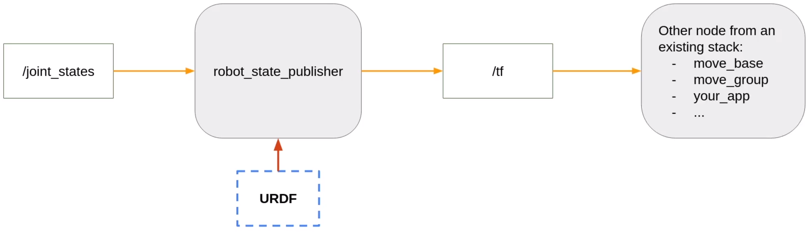

# [ROS2 For Beginners Level 2](https://www.udemy.com/course/ros2-tf-urdf-rviz-gazebo/)


### Setup

* Install Gazebo
  * `sudo apt install ros-humble-gazebo*`
  * `sudo apt install gazebo`
* Install `urdf_tutorial`
  * `sudo apt install ros-humble-urdf-tutorial`
  * Location: `/opt/ros/humble/share/urdf_tutorial/urdf/`
* Install `tf2-tools`: `sudo apt install ros-humble-tf2-tools`


### RViz

RViz is a powerful 3D visualisation tool for ROS. It allows users to visualise data from sensors, robot components, and other sources in a 3D environment, making it easier to understand and debug the behaviour of robots and robotic systems.

* Alpha: Transparency

* Links: Rigid parts of the robot


### TF (TransFrom)

#### Definition

In ROS 2, a transform is a fundamental concept used for representing the relationships between different coordinate frames in a robotic system. These coordinate frame transformations are crucial for understanding the positions and orientations of various components of a robot or objects in its environment. The ROS 2 transform system, often referred to as `TF2` (Transform Library), is a library that manages these coordinate frame transformations.

**Frames**

* Frames, in TF, represent individual coordinate systems in a robotic system. Each frame has a unique name and defines a specific reference point and orientation in 3D space. Frames can represent various elements of a robot, such as its base, sensors, end effectors, or objects in its environment.
* Colour: <span style="color:red;">**X**</span> | <span style="color:green;">**Y**</span> | <span style="color:blue;">**Z**</span> 

**Joints**

* Joints in TF represent the connections between frames. They describe how one frame can move relative to another frame. Joints specify the type of motion allowed, such as rotation or translation, and the axis of motion.

**What we try to achieve with TFs:**

* Keep a structured tree for all the joints/frames over time

**We want to know:**

* How frames are placed relative to one another
* How they move relative to each other

#### Visualise a robot TFs in RViz 2 (`urdf_tutorial`)

```
ros2 launch urdf_tutorial display.launch.py model:=<model_absolute_path>
ros2 launch urdf_tutorial display.launch.py model:=/opt/ros/humble/share/urdf_tutorial/urdf/08-macroed.urdf.xacro
```

#### Visualise the TF tree

* `ros2 run tf2_tools view_frames`
* `frames.pdf` is stored at the current directory


### URDF (Unified Robot Description Format)

#### Definition

* Description of all the elements in a robot
* Used to generate TFs
* XML format
* Visualise the robot on RViz
* XYZ rotation: roll pitch yaw (rpy)

#### Documentation

[URDF Joint](https://wiki.ros.org/urdf/XML/joint)

[URDF Link](https://wiki.ros.org/urdf/XML/link)

#### How the Robot State Publisher and URDF Work Together



**Example**

* `ros2 run robot_state_publisher robot_state_publisher --ros-args -p robot_description:="$(xacro my_robot.urdf)"`
* `ros2 run joint_state_publisher_gui joint_state_publisher_gui`
* `ros2 run rviz2 rviz2`

#### Create a Robot Description Package to Install the URDF

* `cd <workspace>/src`
* `ros2 pkg create <robot>_description`
* `cd <robot>_description`
* `rm -rf include/ src/`
* `mkdir urdf`
* Add following lines into [`CMakeLists.txt`](../src/my_robot_description/CMakeLists.txt)

```cmake
install(
  DIRECTORY urdf
  DESTINATION share/${PROJECT_NAME}/
)
```

* Enter into the workspace and run `colcon build`

#### Add an RViz config in the Launch File:

1. From RViz, save a config with `.rviz` extension
2. In the package, add a `rviz/` folder. Put the `.rviz` file in the folder, install the folder
3. In the launch file, make RViz start with this config
   - for XML: add `args=<config>` in the node tag
   - for python, add `arguments=[list of arguments]` in the node structure


### Xacro

Make the URDF cleaner, more dynamic, modular, scalable

* Properties (variables)
* Macros (functions)
* Include URDF file inside another URDF

